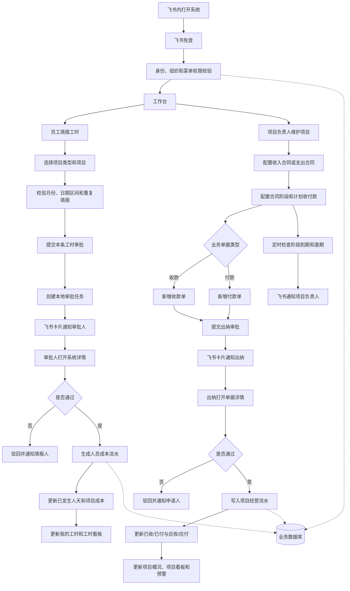

# 综合项目管理系统业务流程图源文件

```mermaid
flowchart TB
    A[飞书内打开系统] --> B[飞书免登]
    B --> C[身份、组织和菜单权限校验]
    C --> D[工作台]

    D --> W1[员工填报工时]
    W1 --> W2[选择项目类型和项目]
    W2 --> W3[校验月份、日期区间和重复填报]
    W3 --> W4[提交本条工时审批]
    W4 --> W5[创建本地审批任务]
    W5 --> W6[飞书卡片通知审批人]
    W6 --> W7[审批人打开系统详情]
    W7 --> W8{是否通过}
    W8 -- 否 --> W9[驳回并通知填报人]
    W8 -- 是 --> W10[生成人员成本流水]
    W10 --> W11[更新已发生人天和项目成本]
    W11 --> W12[更新我的工时和工时看板]

    D --> P1[项目负责人维护项目]
    P1 --> P2[配置收入合同或支出合同]
    P2 --> P3[配置合同阶段和计划收付款]
    P3 --> P4{业务单据类型}
    P4 -- 收款 --> R1[新增收款单]
    P4 -- 付款 --> Q1[新增付款单]
    R1 --> S[提交出纳审批]
    Q1 --> S
    S --> T[飞书卡片通知出纳]
    T --> U[出纳打开单据详情]
    U --> V{是否通过}
    V -- 否 --> V1[驳回并通知申请人]
    V -- 是 --> L[写入项目经营流水]
    L --> L1[更新已收/已付与应收/应付]
    L1 --> L2[更新项目概况、项目看板和预警]

    P3 --> N1[定时检查阶段到期和逾期]
    N1 --> N2[飞书通知项目负责人]

    C -.-> DB[(业务数据库)]
    W10 -.-> DB
    L -.-> DB
```

## 口径说明

- 工时审批是每条工时单独审批；审批通过后才计入已发生人天和人员成本。
- 收款单、付款单分别关联收入合同、支出合同及其阶段，出纳审批通过后才计入项目经营数据。
- 飞书用于免登、组织架构、应用卡片通知；业务详情和审批操作在本系统完成。
- 合同阶段到期和逾期提醒由系统定时检查，通知失败不回滚已经完成的业务操作。
